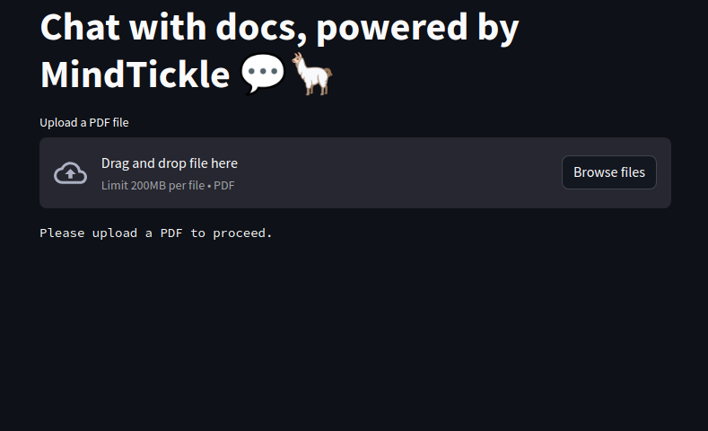

# 🦙📚 Chatbot - Chat with the docs

Build a chatbot powered by LlamaIndex that augments GPT 3.5 with the content  your own data.

## Overview of the App

- Allows users to upload a PDF document and ask questions related to the content of that document.
- Utilizes Streamlit's st.file_uploader, st.chat_input, and st.chat_message to provide a conversational interface.
- Uses LlamaIndex to load, index data, and create a chat engine that retrieves context from the uploaded document to respond to user queries.
- Offers a feedback mechanism to rate the accuracy of the assistant's response.

## Get an OpenAI API key

You can get your own OpenAI API key by following the following instructions:
1. Go to https://platform.openai.com/account/api-keys.
2. Click on the `+ Create new secret key` button.
3. Next, enter an identifier name (optional) and click on the `Create secret key` button.
4. export OPENAI_API_KEY='YOUR_OPENAI_KEY'

## Run the App Locally
Clone the repository from GitHub.
Navigate to the directory containing the app.
Install necessary packages using pip install -r requirements.txt.
Run the app using the command streamlit run app.py.
Enter the OpenAI API key when prompted.
Upload a PDF document and start asking questions related to its content!

## Feedback Mechanism
After receiving a response to your question, you have the option to rate the accuracy of the answer. This feedback is saved in user_feedbacks.csv in the root directory.
